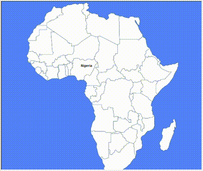

**African Countries Game**

This Python program allows users to interactively guess the names of African countries on a map using the Turtle module. Players input country names, and if guessed correctly, the program marks the location of the country on the map.

**How to Use:**

1. **Install Required Libraries:**
   Ensure you have Python installed on your system along with the Turtle and Pandas libraries. You can install the necessary libraries using pip:

   ```
   pip install turtle
   pip install pandas
   ```

2. **Download Resources:**
   Download the image file "africaMap.gif" and the CSV file "african_countries.csv". Ensure both files are in the same directory as the Python script.

3. **Run the Script:**
   Execute the Python script in your preferred Python environment.

4. **Game Interface:**
   Once the script is running, a window will appear displaying the map of Africa. The program will prompt the player to input a country name.

5. **Guessing Countries:**
   Input the name of an African country. If the guessed country exists, its location will be marked on the map. The player can continue guessing countries until they choose to exit by typing "Exit".

6. **Game Termination:**
   The game automatically ends after 50 guesses or when the player types "Exit".
7. **Game demo**
   

**Files Included:**

- **africaMap.gif**: Image file representing the map of Africa.
- **african_countries.csv**: CSV file containing data about African countries, including their names and coordinates.
- **africa_countries_game.py**: Python script for the game.

**Note:**

- Ensure that the image file "africaMap.gif" and the CSV file "african_countries.csv" are placed in the same directory as the Python script for the program to run successfully.
- Make sure to follow the correct spelling and capitalization of country names when guessing.
- Enjoy exploring and learning about African countries with this interactive game!
